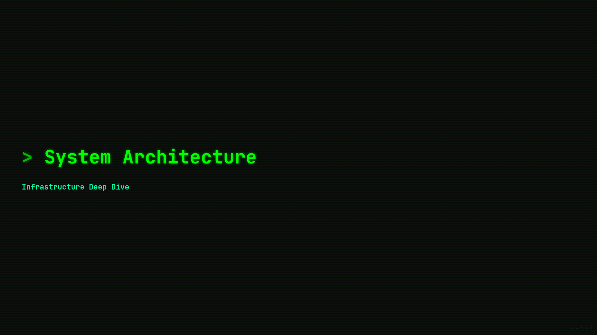
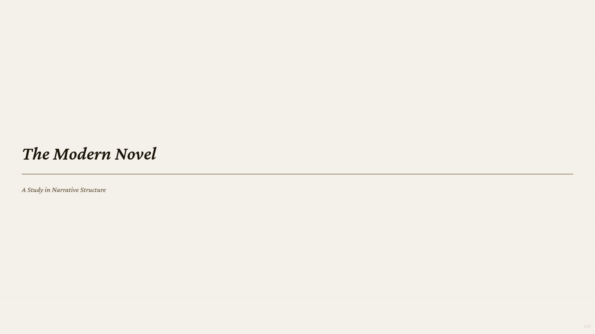
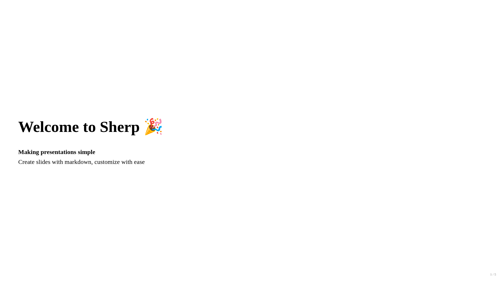

# @skeptrune/sherp-cli

The CLI tool for creating and managing Sherp presentations.

## Installation

```bash
npm install -g @skeptrune/sherp-cli
```

## Usage

```bash
# Create a new presentation
sherp init my-presentation

# Start development server
cd my-presentation
sherp dev

# Build for production
sherp build

# Preview production build
sherp preview
```

## Commands

- `sherp init <name>` - Initialize a new presentation project
- `sherp dev` - Start development server with live reload
- `sherp build` - Build presentation for production
- `sherp preview` - Preview production build

## Themes

Sherp comes with four built-in themes:

<table>
<tr>
<td align="center"><strong>Terminal</strong><br/><em>Green-on-black hacker aesthetic</em><br/></td>
<td align="center"><strong>Paper</strong><br/><em>Sepia/cream academic style</em><br/></td>
</tr>
<tr>
<td align="center"><strong>Corporate</strong><br/><em>Professional navy/blue tones</em><br/></td>
<td align="center"><strong>Default</strong><br/><em>Minimal, no custom styles</em><br/></td>
</tr>
</table>

Select a theme during project creation:

```bash
# Use --theme or -t flag
sherp init my-presentation --theme terminal
sherp init my-presentation -t paper

# Or choose interactively
sherp init my-presentation
```

## Project Structure

Each Sherp project contains a single `presentation.mdx` file along with optional customization files:

- `presentation.mdx` - Your presentation content
- `sherp.config.json` - Project configuration
- `styles/` - Custom CSS files

## Documentation

See the [main README](../../README.md) for full documentation.

## License

MIT
